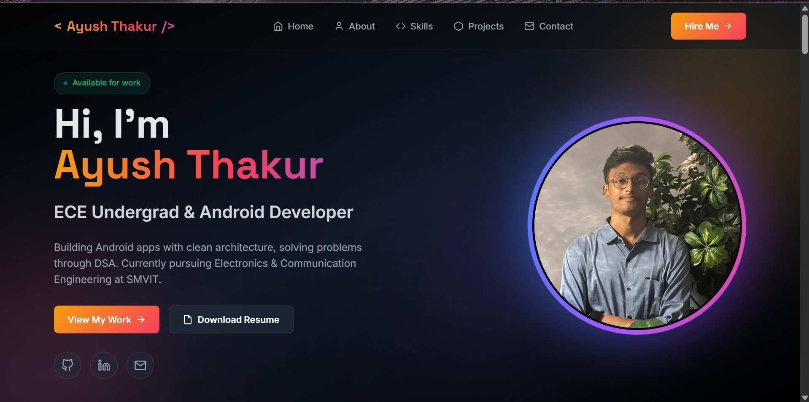

<div align="center">

# ✦ Ayush Thakur - Portfolio

**ECE Undergrad · Android Developer · Problem Solver**

[](https://thakur-027.github.io)
[](https://www.linkedin.com/in/ayush-thakur015)
[](https://github.com/thakur-027)
[](mailto:ayushoct15@gmail.com)

</div>

---

## 📸 Preview



---

## 🚀 Overview

Personal portfolio website for **Ayush Thakur**, a pre-final year B.E. Electronics and Communication Engineering student at **Sir M. Visvesvaraya Institute of Technology (SMVIT), Bengaluru** (Class of 2027). The site showcases projects, technical skills, education, certifications, and contact information - all in a modern, animated dark-themed UI.

> 🔗 **Live:** [https://thakur-027.github.io](https://thakur-027.github.io)

---

## 🖥️ Tech Stack

| Layer | Technology |
|---|---|
| Markup | HTML5 |
| Styling | CSS3 + [Tailwind CSS](https://tailwindcss.com/) (CDN) |
| Scripting | Vanilla JavaScript |
| Fonts | Inter & Space Grotesk via Google Fonts |
| Hosting | GitHub Pages |

No build step, no bundler - just open `index.html` and it works.

---

## 📂 Project Structure

```
thakur-027.github.io/
├── index.html              # Main (and only) page — all sections live here
├── style.css               # Custom styles, animations, and component classes
├── script.js               # Interactivity: mobile nav, scroll effects, typing animation
├── profile_pic.jpg         # Hero profile image
├── AyushThakur_resume.pdf  # Resume linked from the hero CTA
└── README.md
```

---

## 📄 Sections

| # | Section | Description |
|---|---|---|
| 1 | **Hero** | Name, role, animated typing text, resume download, and social links |
| 2 | **About** | Education timeline, certifications, and leadership activities |
| 3 | **Skills** | Programming languages, mobile dev, web, tools, and circuit design |
| 4 | **Projects** | Featured project cards with tech stacks and GitHub links |
| 5 | **Contact** | Email, phone, and location |

---

## 🛠️ Featured Projects

### 📝 The Blog App `2026`
A modern Android blogging platform built with Kotlin and Jetpack Compose. Features include Firebase auth, post creation with a rich text editor, like/save functionality, and real-time updates.

**Stack:** `Kotlin` `Jetpack Compose` `Firebase` `MVVM` `Android`
→ [View on GitHub](https://github.com/thakur-027/The-Blog-App)

---

### 💬 Real-Time Chat Room `2025`
A group messaging Android app with real-time Firebase sync, dynamic chat room creation, and a modern Compose UI. Supports secure authentication and per-message time formatting.

**Stack:** `Kotlin` `Jetpack Compose` `Firebase` `Firestore` `Android`
→ [View on GitHub](https://github.com/thakur-027/Chat-Room-App)

---

### 🔒 Secure Auth System `2025`
A terminal-based authentication system in C++ with a custom SHA-256 password hashing implementation, multi-user support, and CSV-based persistent storage.

**Stack:** `C++` `SHA-256` `File Handling` `CSV`
→ [View on GitHub](https://github.com/thakur-027/cpp-auth-system)

---

## 🎓 Education

| Degree | Institution | Year | Score |
|---|---|---|---|
| B.E. – ECE | Sir M. Visvesvaraya Institute of Technology, Bengaluru | 2023–2027 | 8.3 CGPA |
| 12th Grade | Roseland International School, Rewari | 2020–2021 | 95.17% |
| 10th Grade | Roseland International School, Rewari | 2018–2019 | 93.40% |

---

## 📜 Certifications

- **Android Development Using Kotlin** — Udemy
- **Career Essentials in Generative AI** — Microsoft & LinkedIn
- **Career Essentials in Business Analysis** — Microsoft & LinkedIn
- **British Airways Engineering Job Simulation** — Forage
- **Tata GenAI Powered Data Analytics** — Forage
- **Database for Developers: Foundation** — Oracle Dev Gym
- **Introduction to Generative AI** — AWS SkillBuild

---

## 🏃 Running Locally

No dependencies, no install step needed.

```bash
# Clone the repo
git clone https://github.com/thakur-027/thakur-027.github.io.git

# Open in browser
cd thakur-027.github.io
open index.html         # macOS
start index.html        # Windows
xdg-open index.html     # Linux
```

Or use VS Code's **Live Server** extension for hot-reload during development.

---

## 📬 Contact

| Channel | Details |
|---|---|
| 📧 Email | [ayushoct15@gmail.com](mailto:ayushoct15@gmail.com) |
| 💼 LinkedIn | [linkedin.com/in/ayush-thakur015](https://www.linkedin.com/in/ayush-thakur015) |
| 🐙 GitHub | [github.com/thakur-027](https://github.com/thakur-027) |

---

<div align="center">

&copy; 2026 Ayush Thakur · Crafted with ❤️ and ☕

</div>
